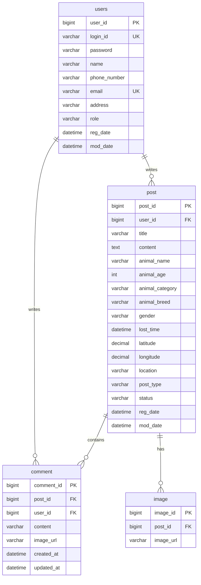

물론입니다! 기획서 발표는 프로젝트의 전체적인 그림과 기술적인 깊이를 잘 보여주는 것이 중요합니다. 제가 기억하고 있는 프로젝트의 모든 내용을 바탕으로, 발표 자료로 바로 활용할 수 있는 기획서 핵심 내용을 만들어 드리겠습니다.

---

### **🚀 '찾아줘요' 프로젝트 기획서 (발표 자료)**

#### **1. 기획 의도 및 목표**

*   **배경:** 반려동물 양육 인구 증가와 함께 심각한 사회 문제로 대두된 유기·실종 동물 문제 해결에 기여하고자 프로젝트를 기획했습니다.
*   **핵심 목표:** 실종 및 보호 동물의 정보를 **지도 기반으로 시각화**하고, 사용자의 **집단 지성(제보 참여)**을 유도하여 동물이 가족의 품으로 돌아가는 시간을 단축시키는 것을 목표로 합니다.
*   **주요 기능:**
    *   실종 동물 등록 및 지도 표시 (찾아요)
    *   보호/목격 동물 등록 및 지도 표시 (기다려요)
    *   이미지 첨부가 가능한 댓글 제보 시스템
    *   게시글 상태 관리 (진행중 → 완료 처리)

---

#### **2. 개발 환경 및 도구**

##### **2.1. 개발 환경 (Development Environment)**

| 구분     | 기술 스택                                           | 목적                         |
| :------- | :-------------------------------------------------- | :--------------------------- |
| **IDE**  | `IntelliJ IDEA`, `WebStorm`                         | Java/React 개발 생산성 향상  |
| **DB**   | `MariaDB`                                           | 데이터 영속성 관리           |
| **서버** | 내장 Tomcat (Spring Boot), `Node.js` (React 개발서버) | 애플리케이션 실행 환경       |
| **협업** | `Docker`                                            | 개발 환경 통일 및 배포 용이성 |

##### **2.2. 개발 도구 (Tools & Libraries)**

| 구분         | 기술 스택                                     | 목적                                                         |
| :----------- | :-------------------------------------------- | :----------------------------------------------------------- |
| **Backend**  | `Spring Boot`, `Spring Data JPA`              | 안정적이고 빠른 백엔드 서버 구축 및 데이터베이스 연동        |
|              | `QueryDSL`                                    | **동적 쿼리** 생성을 통한 복잡한 조건의 게시글 검색 기능 구현 |
|              | `Spring Security` + `JWT`                     | 토큰 기반의 안전한 사용자 인증 및 인가 처리                  |
|              | `Lombok`, `ModelMapper`                       | 반복적인 코드 제거 및 객체 간의 유연한 매핑                  |
| **Frontend** | `React`, `React Router`                       | SPA(Single Page Application) 기반의 동적인 사용자 인터페이스 구축 |
|              | `Axios`                                       | **인터셉터**를 활용한 비동기 API 통신 및 토큰 자동 갱신 처리 |

---

#### **3. 전체 시스템 아키텍처**

저희 프로젝트는 역할과 책임이 명확하게 분리된 **3-Tier 아키텍처**를 기반으로 설계되었습니다.

```
[사용자 (웹 브라우저)]
       ↑ ↓  (UI/UX 상호작용)
+--------------------------------+
|      Frontend Server           |
|  (React / Node.js / WebStorm)  |
|  - UI 컴포넌트 렌더링          |
|  - 사용자 상태 관리 (Context)  |
+--------------------------------+
       ↑ ↓  API 요청(Request) / 데이터 응답(Response)
+--------------------------------+
|        Backend Server          |
|  (Spring Boot / IntelliJ IDEA) |
|  - API Endpoints (Controller)  |
|  - 비즈니스 로직 (Service)     |
|  - 데이터 접근 (Repository)    |
|  - 보안 (Spring Security)      |
+--------------------------------+
       ↑ ↓  (JPA / QueryDSL)
+--------------------------------+
|        Database                |
|         (MariaDB)              |
+--------------------------------+
```
*   **Frontend (Client):** 사용자가 직접 상호작용하는 화면으로, React를 통해 구현되었습니다. Axios를 사용하여 백엔드 서버에 필요한 데이터를 요청하고 응답을 받아 화면에 표시합니다.
*   **Backend (Server):** Spring Boot를 기반으로 비즈니스 로직을 처리하고 데이터베이스를 관리합니다. Frontend로부터 들어온 요청을 받아 처리한 후, 결과를 JSON 형태로 응답합니다.
*   **Database:** 모든 사용자 정보, 게시글, 댓글, 이미지 데이터는 MariaDB에 영구적으로 저장됩니다.

---

#### **4. 데이터베이스 설계 (ERD)**

제공해주신 최신 엔티티 클래스 파일을 기반으로 ERD를 다시 생성했습니다. `User`, `Post`, `Comment`, `Image` 간의 관계를 명확하게 표현합니다.



*   **핵심 관계:**
    *   한 명의 **User**는 여러 개의 **Post**와 **Comment**를 작성할 수 있습니다.
    *   하나의 **Post**는 여러 개의 **Comment**와 **Image**를 가질 수 있습니다.

---

#### **5. 핵심 기능 및 기술 (추천)**

발표 시 저희 프로젝트의 기술적인 강점을 어필할 수 있는 부분들입니다.

1.  **JWT 기반의 인증/인가 시스템**
    *   `Spring Security`와 `JwtAuthenticationFilter`를 커스텀하여, 사용자의 모든 요청에 대해 토큰을 검증하고 안전하게 권한을 부여하는 시스템을 구축했습니다. Axios 인터셉터를 통해 토큰 만료 시 자동으로 재발급받는 로직을 구현하여 사용자 편의성을 높였습니다.

2.  **QueryDSL을 활용한 동적 검색 기능**
    *   단순 키워드 검색을 넘어, 동물 종류, 지역, 실종 기간 등 **다양한 조건이 조합된 복잡한 검색**이 가능하도록 `QueryDSL`을 도입했습니다. 이를 통해 사용자는 원하는 정보를 더 정밀하고 빠르게 찾을 수 있습니다.

3.  **JPA를 활용한 객체지향적 데이터 관리**
    *   `@OneToMany`, `@ManyToOne` 등 연관관계 매핑과 `Cascade` 옵션을 적극적으로 활용하여, 게시글 삭제 시 관련 댓글과 이미지가 자동으로 삭제되는 등 **데이터의 정합성을 보장**했습니다. 또한, 서비스 로직에서 **더티 체킹(Dirty Checking)**을 활용하여 효율적인 데이터 업데이트를 구현했습니다.

4.  **인터페이스 기반의 유연한 파일 처리**
    *   `FileUploadService`라는 인터페이스를 설계하여 파일 업로드 로직을 분리했습니다. 현재는 로컬 서버에 파일을 저장하지만, 향후 **AWS S3**와 같은 클라우드 스토리지로 변경이 필요할 경우, 기존 코드의 수정 없이 구현체만 교체하면 되도록 **유연하고 확장 가능한 구조**를 만들었습니다.